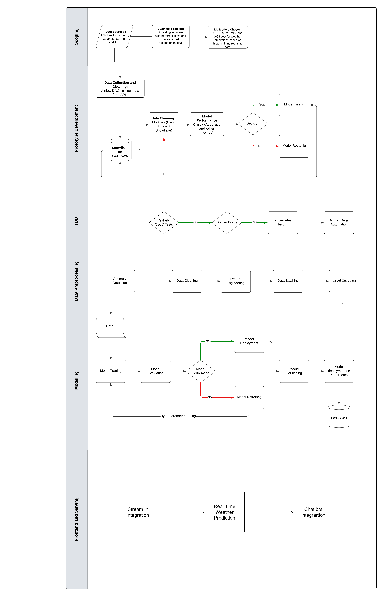

# ClimaSmart

ClimaSmart is a next-generation AI-powered weather prediction system designed to provide highly accurate, real-time weather forecasts alongside personalized recommendations. The system offers features such as Weather-Based Commute Suggestions, Outdoor Adventure Recommendations, and an interactive chatbot for real-time queries about weather conditions.

## Workflow


## Project Scope
[Project Scope Document](reports/Project_Scoping_Group_8.pdf)

## Project Organization

```
├── LICENSE                <- Open-source license if one is chosen
├── Makefile               <- Makefile with convenience commands like `make data` or `make train`
├── README.md              <- The top-level README for developers using this project.
├── data
│   ├── external           <- Data from third party sources.
│   ├── interim            <- Intermediate data that has been transformed.
│   ├── processed          <- The final, canonical data sets for modeling.
│   └── raw                <- The original, immutable data dump.
│
├── docs                   <- A default mkdocs project; see www.mkdocs.org for details
│
├── dags                   <- Directory for Airflow DAGs and utility scripts
│   ├── utils.py            <- Utility functions used across different scripts
│   ├── constants.py            <- Constants used across different scripts
│   ├── weather_data_collection.py           <- Script to collect weather data
│   ├── weather_data_collection_dag.py       <- Airflow DAG for scheduling data collection
│   ├── weather_data_preprocessing.py        <- Script for data preprocessing
│   └── weather_data_visualization.py        <- Script for generating data visualizations
│
├── models                 <- Trained and serialized models, model predictions, or model summaries
│
├── notebooks              <- Jupyter notebooks for exploratory data analysis and initial prototyping
│   ├── 1.0-jqp-initial-data-exploration.ipynb
│
├── pyproject.toml         <- Project configuration file with package metadata for clima_smart and configuration for tools like black
│
├── references             <- Data dictionaries, manuals, and all other explanatory materials.
│
├── reports                <- Generated analysis as HTML, PDF, LaTeX, etc.
│   └── figures            <- Generated graphics and figures to be used in reporting
│
├── requirements.txt       <- The requirements file for reproducing the analysis environment, e.g. generated with `pip freeze > requirements.txt`
│
├── setup.cfg              <- Configuration file for flake8
│
└── clima_smart            <- Source code for use in this project.
    ├── __init__.py        <- Makes clima_smart a Python module
    ├── config.py          <- Store useful variables and configuration
    ├── dataset.py         <- Scripts to download or generate data
    ├── features.py        <- Code to create features for modeling
    ├── modeling           <- Subpackage for model training and prediction
    │   ├── __init__.py
    │   ├── predict.py     <- Code to run model inference with trained models          
    │   └── train.py       <- Code to train models
    └── plots.py           <- Code to create visualizations
```

---

# Data Pipeline for Weather Collection, Processing, and Analysis

This section provides details on the ClimaSmart Data Pipeline, which uses Apache Airflow for orchestration within Google Cloud Platform (GCP). The pipeline automates weather data collection, processing, feature engineering, and quality validation to support ClimaSmart’s AI-powered weather prediction.

## Platform Overview

- **Platform**: Google Cloud Platform (GCP)
- **Orchestration**: Apache Airflow via Cloud Composer
- **Pipeline Objective**: Automated weather data collection, processing, and quality validation for data-driven insights.

## Pipeline Architecture

The pipeline consists of six core steps, each handled by a separate Directed Acyclic Graph (DAG) in Airflow. Each DAG automates specific tasks to streamline weather data processing from initial collection to final validation.

---

### DAG Workflow and Status


| DAG                              | Purpose                                      | Status               |
|----------------------------------|----------------------------------------------|----------------------|
| Fetch and Save Daily Weather     | Retrieves daily data                         | Successfully Running |
| Fetch and Save Hourly Weather    | Retrieves hourly data                        | Successfully Running |
| Preprocess Data                  | Handles missing values, transformations      | Successfully Running |
| Feature Engineering & Visualization | Creates new features and visuals      | Successfully Running |
| Schema Statistics                | Generates schema metadata                    | Successfully Running |
| Data Validation                  | Ensures schema and data quality              | Successfully Running |

---

### Detailed Workflow of Each Step

#### 1. Fetch and Save Daily Weather Data
- **Objective**: Retrieve daily weather data from external APIs and store it in Google Cloud Storage (GCS).
- **Process**:
  - **Data Collection**: Uses APIs like Open-Meteo’s Historical Weather API with the `requests` library.
  - **Data Processing**: Structures data with **pandas**, applying time zone standardization and formatting.
  - **Storage**: Saves as CSV in GCS.
- **DAG Status**: Successfully running, scheduled to run daily.

#### 2. Fetch and Save Hourly Weather Data
- **Objective**: Capture hourly weather data for granular analysis.
- **Process**:
  - **Data Collection**: Fetches hourly data via API calls with `requests`.
  - **Data Processing**: Formats data with **pandas**, aggregating and aligning time zones.
  - **Storage**: Saves in CSV format in GCS.
- **DAG Status**: Successfully running, scheduled to run hourly.

#### 3. Preprocess Daily and Hourly Data
- **Objective**: Ensure data quality through preprocessing.
- **Process**:
  - **Handling Missing Values**: Uses **pandas** and **numpy** for filling or dropping null values.
  - **Data Transformation**: Standardizes temperature units and dates.
  - **Outlier Detection**: Identifies and handles outliers using **scikit-learn**.
- **DAG Status**: Successfully running, ensuring consistent data for downstream tasks.

#### 4. Feature Engineering and Visualization
- **Objective**: Enrich data and create visualizations for analysis.
- **Process**:
  - **Feature Engineering**: Generates rolling averages, temperature differentials using **pandas**.
  - **Visualization**: Generates time series plots, heatmaps, histograms using **matplotlib** and **seaborn**.
- **DAG Status**: Successfully running, generating feature-rich datasets and visuals.

#### 5. Generate and Save Schema Statistics
- **Objective**: Provide summary metadata for validation.
- **Process**:
  - **Schema Generation**: Computes min, max, and mean for each feature.
  - **Storage**: Saves statistics in GCS for reference.
- **DAG Status**: Successfully running, schema statistics available for validation.

#### 6. Validate Weather Data and Test Data Quality and Schema
- **Objective**: Validate data quality and schema adherence.
- **Process**:
  - **Schema Validation**: Ensures data conforms to expected column names and types.
  - **Quality Testing**: Tests for duplicates, null values, and schema compliance using **pandas**.
- **DAG Status**: Successfully running, validating data quality.

---

### Technology Stack and Dependencies

- **Orchestration**: Apache Airflow within Cloud Composer.
- **Storage**: Google Cloud Storage (GCS) for data files and schema metadata.
- **Python Libraries**:
  - **pandas** and **numpy** for data handling.
  - **requests** for API interactions.
  - **matplotlib** and **seaborn** for visualization.
  - **scikit-learn** for outlier detection and normalization.

### Orchestration and Scheduling with Apache Airflow
Airflow DAGs manage each stage, enabling robust monitoring and modularity. Each task is triggered on a schedule:
- **Daily Pipeline**: Runs each morning for daily data.
- **Hourly Pipeline**: Runs hourly to capture real-time data.

---

## DVC Integration for Data Tracking and Version Control

Integrating **Data Version Control (DVC)** with ClimaSmart’s pipeline helps manage and track data versions. Key tracked files include raw data, processed data, feature-engineered datasets, and visualizations.

### DVC Setup
1. **Initialize DVC**:
   ```bash
   dvc init
   ```
2. **Add Remote Storage**:
   ```bash
   dvc remote add -d myremote gs://your-gcs-bucket/dvc-storage
   ```
3. **Track Data Files**:
   ```bash
   dvc add data/raw/daily_weather.csv
   dvc add data/raw/hourly_weather.csv
   dvc add data/processed/preprocessed_daily.csv
   dvc add data/processed/preprocessed_hourly.csv
   dvc add data/featured/engineered_data.csv
   ```

### DVC Benefits
Using DVC enhances reproducibility and traceability of data changes across the pipeline stages, with remote storage providing scalable data access.

---

## Conclusion

The ClimaSmart Data Pipeline offers a robust solution for automated weather data processing. Each Airflow DAG is independently managed, ensuring modularity, scalability, and reliability for data-driven applications.

For any further setup instructions or pipeline expansion, refer to [Detailed Pipeline Documentation](reports/Data_Pipeline_Group8.pdf).
